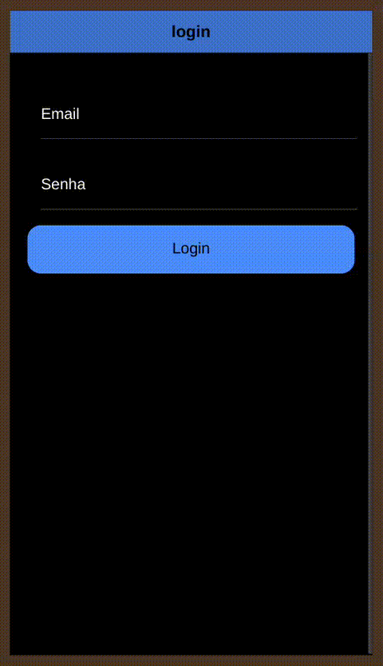
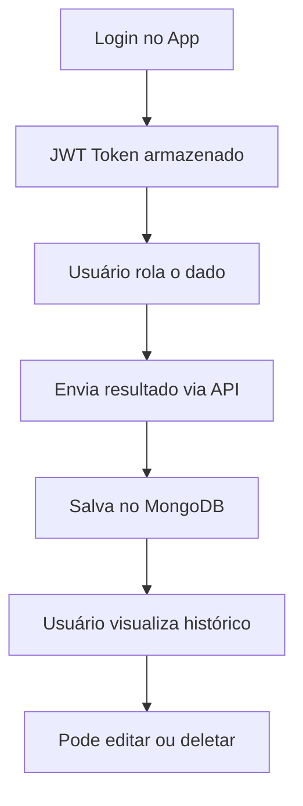

# 🎲 Dice & Dealers

## ✨ Visão Geral

Dice & Dealers é um app mobile de rolagem de dados com animação 3D, persistência de histórico e autenticação de usuários. Ideal para jogos, estudos estatísticos ou diversão.

> "Role seus dados, registre sua sorte, acompanhe seu histórico."

---

## 📱 Aplicativo Mobile

### Imagem da Interface:


### Funcionalidades:

- Rolar dado d6 com botão ou movimento
- Animação 3D realista do dado
- Histórico de rolagens
- Edição e exclusão de resultados
- Login/logout com token JWT
- Interface com abas (Rolls, Histórico, Perfil)

### Tecnologias:

- Ionic + Angular
- Cordova Device Motion
- Storage local com `@ionic/storage-angular`
- Integração com API Express + MongoDB

### Instalação:

```bash
npm install -g @ionic/cli
npm install
ionic serve
```

### Gerar APK:

```bash
ionic capacitor build android

---

## 🌐 Backend

### Funcionalidades:

- Registro e login de usuários
- Autenticação com JWT
- Registro de rolagens (dado e resultado)
- Recuperar histórico
- Atualizar ou deletar uma rolagem

### Tecnologias:

- Node.js + Express
- MongoDB (Atlas ou local)
- Mongoose
- JWT
- dotenv, cors

### Instalação:

```bash
npm install
npm run dev
```

### .env (com MongoDB Atlas):

```env
MONGO_URI=mongodb+srv://<usuario>:<senha>@<cluster>.mongodb.net/dice_and_dealers?retryWrites=true&w=majority
JWT_SECRET=sua_chave_super_secreta
```

---

## 📂 Estrutura

```
diceAndDealer/
├── backend/
│   ├── controllers/
│   ├── routes/
│   ├── models/
│   └── server.js
└── frontend/
    ├── pages/
    ├── services/
    └── app.module.ts
```

---

## 🔄 Fluxo da Aplicação



---

## 📦 Repositórios

- 🔗 [Frontend - Ionic](https://github.com/jeeboeira/diceAndDealer)
- 🔗 [Backend - Express + MongoDB](https://github.com/jeeboeira/backend-DiceAndDealer)

---

## 🎓 Projeto acadêmico

Disciplina: **Desenvolvimento de Sistemas Mobile**  
Aluno: **Jesse Boeira**

---